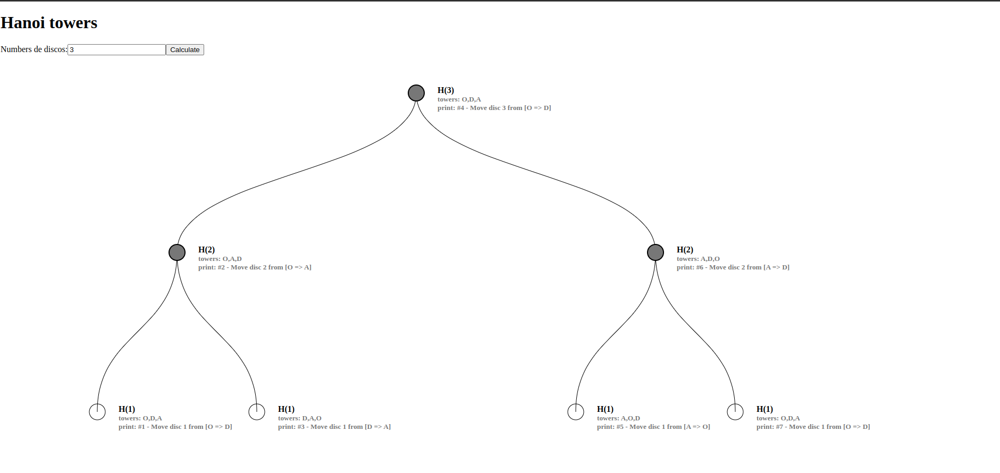

# Hanoi

## English
### The problem

The problem consists of 3 towers or spikes on which rest a set of discs or rings, ordered from the largest size to the smallest size.
The objective is to move these discs from one tower to another following these 2 rules:
Only one disco can be moved at a time.
You cannot place a larger disk on top of a smaller one.

### Execution
You can use yarn to run the project or just run docker and expose port 80

## Español
### El problema

El problema consta de 3 torres o espigas sobre las que descansan un conjunto de discos o anillos, ordenados de mayor a menor tamaño.
El objetivo es mover estos discos de una torre a otra siguiendo estas 2 reglas:
Solo se puede mover una discoteca a la vez.
No puede colocar un disco más grande encima de uno más pequeño.

### Ejecución
Puede usar yarn para ejecutar el proyecto o simplemente ejecutar Docker y exponer el puerto 80

## Resultados
